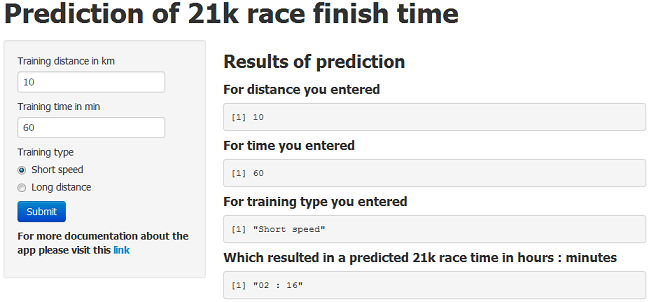

## Running race finish time calculator

My course project is a calculator that predicts my expected 21 kilometer running race finish time.

In the weeks prior to any race, I train by running shorter distances several times per week. Each time I train, I record the distance (in kilometers) that I ran and the time (in minutes) it took me to finish. I use this as input to calculate my expected 21 kilometer finish time modified by a factor which increases the predicted finish time by 8% if I was running a short speed training or decreases the predicted finish time by 8% if I was running a long distance training.

For example, if I run 10 kilometers in 60 minutes in a short speed pace, my expected 21k finish time would be 


```r
distance <- 10
timeMin <- 60
time21k <- (timeMin / distance) * 21 * 1.08
time21k
```

```
## [1] 136.1
```

The result is 136 minutes or two hours and 16 minutes.

My shiny app is designed so that the user may enter the three pieces of input information, the distance in kilometers, the time in minutes and an option whether it was a short speed or a long distance type of training.

Here is a sample screenshot from the application with defalut values:



After pressing the Submit button, the result is calculated, displaying the predicted 21 kilometer race finish time based on the input data.

Some formatting is also added so that the result is displayed in a more clear format by converting the total number of minutes into hours and minutes.
